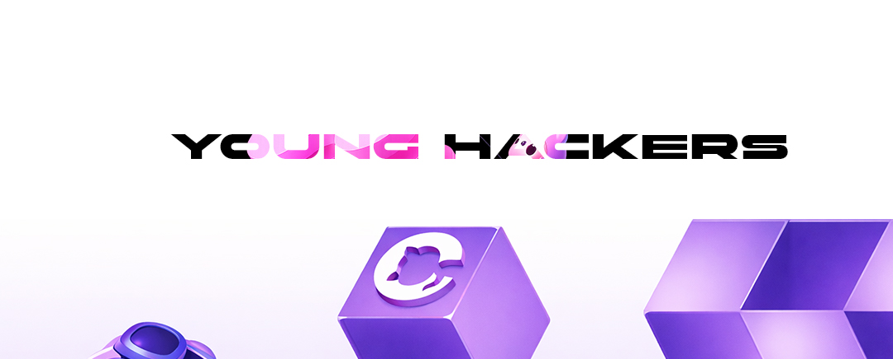

#EyecodeUniversity #Task
<h2>👥 Студенты </h2>
<ul>
  <li>Student ID: #FD-031125-025 — Алексей Л. </li>
  <li>Student ID: #FD-031125-851 — Максим     </li>
  <li>Student ID: #FD-031125-852 — Никита     </li>
</ul>
<h1>💎 Персональная игровая страница (Game Profile)</h1>

Example:Вам необходимо создать одностраничный сайт, который будет выглядеть как аккаунт игрока в видеоигре, но вместо игровых достижений будут отображаться ваши реальные достижения в жизни.

Страница должна представлять собой профиль игрока, где отображается ваш персонаж, уровень, опыт и достижения.

После завершения работы сайт необходимо загрузить на GitHub и опубликовать в интернете через GitHub Pages.

Основные элементы страницы

🧑‍🚀 Аватар игрока
Добавьте свою фотографию или любой аватар.

🏆 Достижения (Achievements)
Создайте блок с вашими достижениями в жизни.

Например:

Изучил JavaScript

Прочитал 10 книг

Начал заниматься спортом

Создал первый сайт

Изучил React

Каждое достижение должно отображаться в виде кубка или награды.

⭐ EXP (Опыт)
Добавьте шкалу опыта, которая показывает ваш прогресс.

Например:
<pre>
Level 7
EXP: 720 / 1000
</pre>

Можно сделать прогресс-бар. 

🌆🌅Галерея

Создайте раздел с галереей изображений.

Это могут быть:
ваши фотографии
изображения
картинки

скриншоты ваших проектов

 
📤 Сдача
 
Отправить ссылку на репозиторий GitHub или в личные сообщения архив ZIP.
 
⏳ Дедлайн: 14 дней 
 <a href="https://www.eyecodeuniversity.ru">www.eyecodeuniversity.ru</a> 

